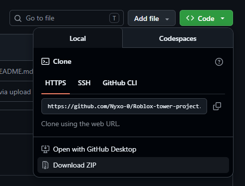
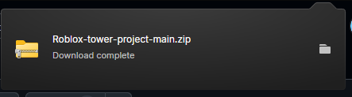
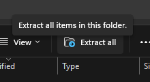
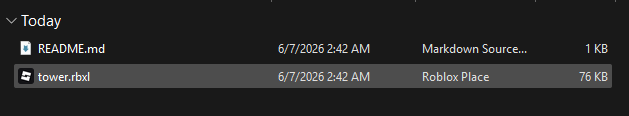
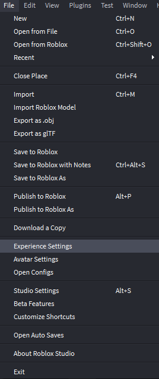
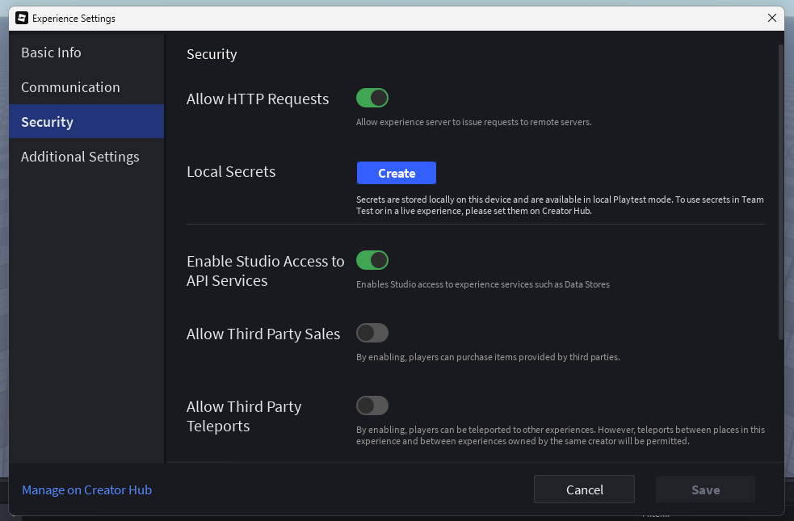

# Tower Elevator Game

A game about getting to the top of a tower, but running into unexpected challanges on the way!

⚠️ **Accessibility Issues:** Unfortunately due to Roblox age restrictions, some users may not be able to play the game, therefore, the game files will be here for anyone to download ⚠️

## How to play the game

### Method 1: Playing on Roblox (suggested method)
1) Go to https://nyxo-0.github.io/Roblox-tower-project/
2) Click the hyperlink
3) Play on Roblox as you would a normal Roblox game

*If this method fails for you due to age restrictions, move on to method 2.*

### Method 2: Running game locally on Roblox Studio
1) Click on the code button and click download zip
   
   
   
2) Open up your downloaded zip
   
   

3) Extract your zip file
   
   

4) Open up your extracted zip file and you should see a .rbxl file
   
   

5) Open the .rbxl file up using roblox studio
   
7) once you are in your local copy, go to the top left corner where you see the "Files" tab, click on it, and click "Experience Settings"

   

8) In the Experience Settings page, click on the "Security" tab and enable "Allow HTTP Requests" and "Enable Studio Access to API Services." Now you should have a local copy of the game that you can play (there will be issues with this, so it is **HIGHLY** recommended you use the actual game on Roblox!)
   
   
   
*Keep in mind you need [Roblox Studio](https://create.roblox.com/docs/tutorials/curriculums/studio/install-studio) to open the file up! Also remember that there may be permission errors with things like audio in your local version.*
